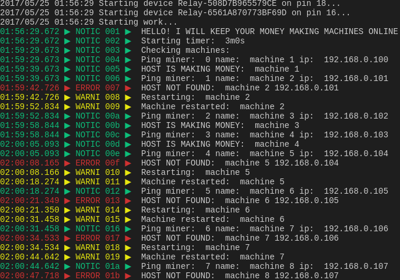
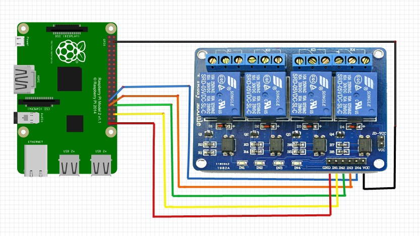

# RPi miner auto-hard-reset
Simple Go program for automatically hard reset a computer with Raspberry Pi or other mini-computer from the GPIO pins
#### Still in progress



I'm using 5V relay and checking the miners with ping command. If there is no answer - hard-reset with the GPIO pins.

### Logic
 * Ping miners at most every 30 minutes (the period is configurable).
 * if offline > send signal for 5 sec (turn off pc), pause 5 sec(wait) and send signal again for 0.108 second (turn on pc)

### How-to
I'm using Raspberry Pi with 5V relay. Soon I will add detailed instruction but you can find a lot of information how to use 5v relay with Raspberry Pi. This is the basics.



Depending of your Raspberry Pi version, download one of the archives
`arm6` - (Raspberry Pi A, A+, B, B+, Zero)
`arm7` - (Raspberry Pi 2, 3)

Open the folder from the console and type (example with arm7)

```
tar -xvzf auto-hard-reset-arm7.tar.gz
chmod +x auto-hard-reset-arm7
```
and after you configure the `config.json`
```
./auto-hard-reset-arm7
```

Configuration for this program is stored in file config.json .
Example config.json:
```
{
    "WaitSeconds": 1800, //time in seconds 
    "StartupCheck" : true, //check miners on program startup
    "Log" : true, //If you want output log - true
    "Pushover": false, //true if you want notifications over Pushover app
    "PushoverToken": "your access token",
    "PushoverUser": "your user token",
    "Miners": [
        {   "Name": "machine 1", "Pin": "40", "Ip": "192.168.0.100", "Info": "R9 290's"  },    
        {   "Name": "machine 2", "Pin": "38", "Ip": "192.168.0.101", "Info": "RX480's"   }      
    ]
}
```

### Build
##### Requirements
* Raspberry Pi
* Golang >= 1.8.0

Type `go get -u -v github.com/kasmetski/auto-hard-reset`

If you are building on your Raspberry Pi, type `go build *.go` in the folder.
If you are building on your workstation type `GOARM=6(or 7) GOARCH=arm GOOS=linux go build *.go`
##### GOARM=6 (Raspberry Pi A, A+, B, B+, Zero) GOARM=7 (Raspberry Pi 2, 3)

### ToDo
* web interface
* JSON-check
* instructions
* statistics
