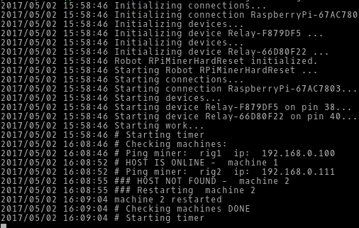
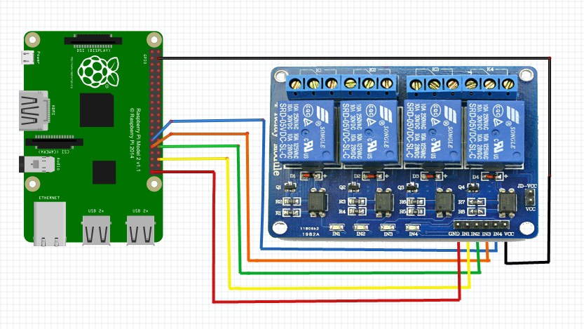

# RPi miner auto-hard-reset
Simple Go program for auto-hard-reset computer with Raspberry Pi or other mini-computer
#### Still in progress


First commit is the prototype. I'm using 5V relay and checking the miners with ping command. If there is no answer - hard-reset with the GPIO.

### Requirements
* Raspberry Pi
* Golang >= 1.8.0

### Logic
 * Ping miners at most every 30 minutes (the period is configurable).
 * if offline > send signal for 5 sec (turn off pc), pause 5 sec(wait) and send signal again for 0.108 second (turn on pc)

### How-to
I'm using Raspberry Pi with 5V relay. Soon I will add detailed instruction but this is the basics.

Soon binary files.

Use  `go get -u -v github.com/kasmetski/auto-hard-reset` instead of `git clone`

Configuration for this program is stored in file config.json .
Example config.json:
```
{
    "WaitSeconds": 1800,
    "Miners": [
        {   "Name": "machine 1", "Pin": "40", "Ip": "192.168.0.100", "Info": "R9 290's"  },
        {   "Name": "machine 2", "Pin": "38", "Ip": "192.168.0.101", "Info": "RX480's"   }
    ]
}
```

### Build
If you are building on your Raspberry Pi, type `go build *.go` in the folder.
If you are building on your workstation type `GOARM=6(or 7) GOARCH=arm GOOS=linux go build *.go`
##### GOARM=6 (Raspberry Pi A, A+, B, B+, Zero) GOARM=7 (Raspberry Pi 2, 3)

### ToDo
* web interface
* JSON-check
* instructions
* statistics
